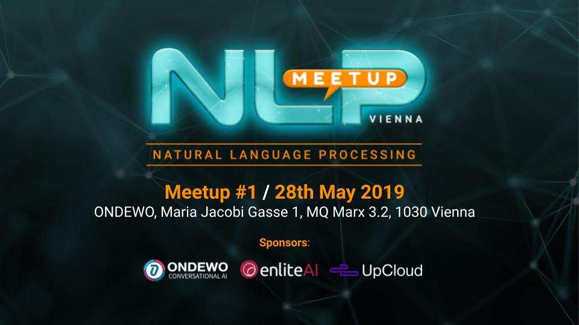

# NLP Meetup Vienna

## Slides, code and resources

Welcome to the official github of NLP Vienna Meetup.

In this repository you may find meetup-related files, presentations, code snippets and more.

* [Attend our meetups here](https://www.meetup.com/nlp-vienna/)
* [Join the community on slack](https://join.slack.com/t/nlp-at/shared_invite/enQtNjMxNTgzOTkyNzc0LWRhODU0YjA2M2FjYjdkMGFiMzZiMDU5OGFiZDg1NmU1NmY4Y2MxZjkzMDg3NGRjYmRjNTY2NmE5ZTM3NzYwM2I) to exchange ideas, assist each other and discuss natural language processing news and issues.
* [Follow us on Twitter](https://twitter.com/NlpVienna): @NlpVienna
