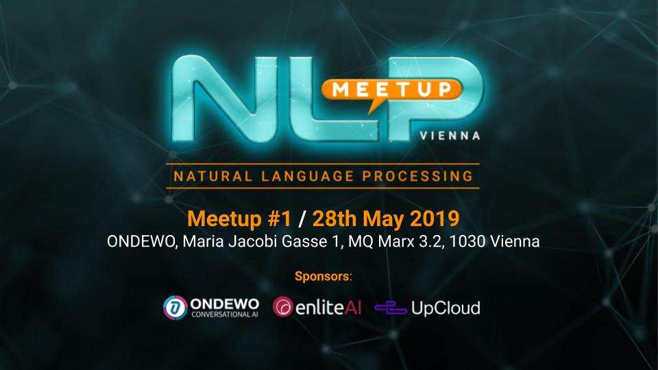

# NLP Meetup Vienna

## Overview
Welcome to the official github of NLP Vienna Meetup.

In this repository you may find meetup-related files, presentations, code snippets and more.

## Resources
* [Attend our meetups](https://www.meetup.com/nlp-vienna/)
* [Join the community on slack](https://join.slack.com/t/nlp-at/shared_invite/enQtNjMxNTgzOTkyNzc0LWRhODU0YjA2M2FjYjdkMGFiMzZiMDU5OGFiZDg1NmU1NmY4Y2MxZjkzMDg3NGRjYmRjNTY2NmE5ZTM3NzYwM2I) to exchange ideas, assist each other and discuss natural language processing news and issues.
* Follow us on Twitter: [@NlpVienna](https://twitter.com/NlpVienna)

## Sponsors
We are thankful to our sponsors: [ONDEWO](https://www.ondewo.com/) and [enliteAI](https://www.enlite.ai/) for the support!

## Meetups

| #  | Date       | Venue                              | Topic                  | Content                         |  Photos | Meetup.com |
|:--:|:----------:|:----------------------------------:|:----------------------:|:----------------------------:|:------:|:----------:|
| 1  | 2019-05-28 | ONDEWO                           | Text Classification & Topic Modeling | [more](./01/)  |       | [link](https://www.meetup.com/nlp-vienna/events/261452867/)
| 2  | 2019-06-19 | PwC Austria                      | Sentiment Analysis | [more](./02/)  |       | [link](https://www.meetup.com/nlp-vienna/events/261668106/)
